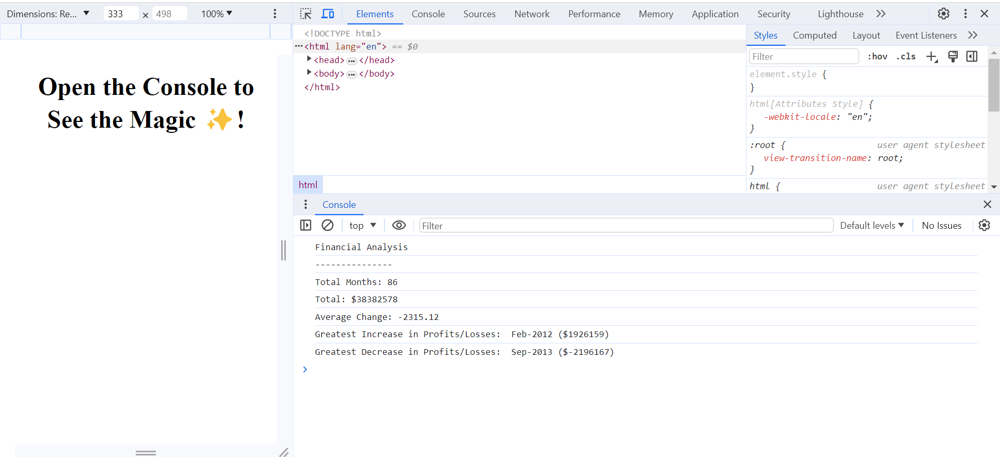

# Console-Finances
Javascript practice by analysing finances

## Descritption
This project involved completing a series of tasks to implement and become familiar with javascript. The aim of the project was to complete a fianancial analysis on a given 2d array of data including the month and year in the first column and the revenue in the second column. The tasks included the use of for loops, if statements, indexing a 2d array and using console.log to print outputs to the console. In this particular project, the skill of logic was developed and understood as an important part of coding a problem in javascript. I enjoyed this assignment! 

## The aim of this project was to produce the following in the console:  

  ```text
  Financial Analysis 
  ----------------
  Total Months: 86
  Total: $38382578
  Average Change: -2315.12
  Greatest Increase in Profits/Losses: Feb-2012 ($1926159)
  Greatest Decrease in Profits/Losses: Sep-2013 ($-2196167)
  ```

### The tasks involved 
* The total number of months included in the dataset.

* The net total amount of Profit/Losses over the entire period.

* The average of the **changes** in Profit/Losses over the entire period.

* The greatest increase in Profit/Losses (date and amount) over the entire period.

* The greatest decrease in Profit/Losses (date and amount) over the entire period.

### Screenshot of deployed application with console view 



### Link to deployed application
Access the live application [here](https://jessi994.github.io/Console-Finances/)


### Credits

N/A

### License

N/A
